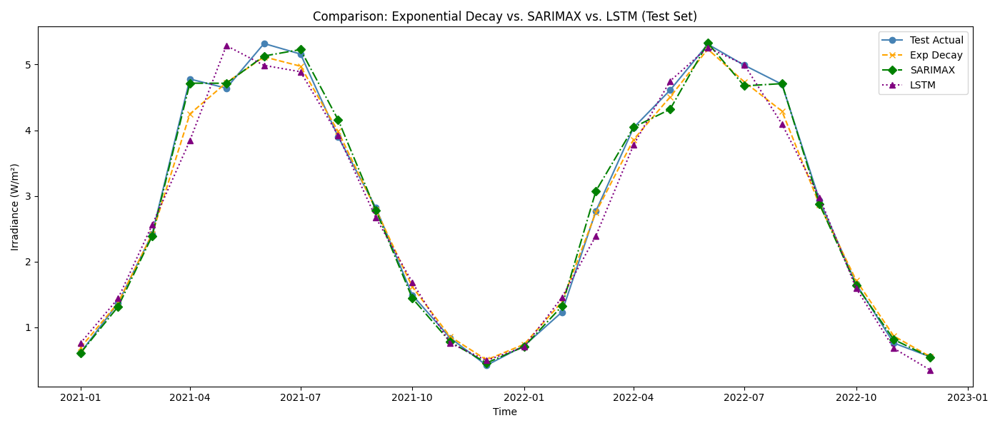

# ☁️ Cloud Cover Forecasting

This project aims to forecast solar irradiance under cloud coverage using three models:

- Exponential Decay Model (based on physical formula)
- SARIMAX (statistical time series model)
- LSTM (deep learning model using PyTorch)

## 📂 Project Structure

- `data/` — input data (Data.csv)
- `models/` — model scripts
- `utils/` — preprocessing, visualization, evaluation
- `results/` — generated plots
- `main.py` — runs the whole pipeline

## 📊 Evaluation Results

| Model              | MAE     | MSE     | MAPE   |
|-------------------|---------|---------|--------|
| Exponential Decay | 0.0303  | 0.1197  | 5.23%  |
| SARIMAX           | 0.01796 | 0.0881  | 3.56%  |
| LSTM              | 0.0926  | 0.2196  | 10.31% |

## 📈 Model Comparison



## ▶️ Run this project

```bash
pip install -r requirements.txt
python main.py
